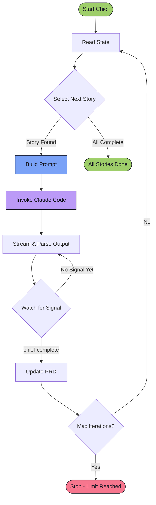

# The Ralph Loop

The Ralph Loop is Chief's core execution model—a continuous cycle that drives Claude to complete user stories one by one. It's the engine that makes autonomous development possible.

::: tip Background Reading
For the motivation and philosophy behind this approach, read the blog post [Ship Features in Your Sleep with Ralph Loops](https://larswadefalk.com/ship-features-in-your-sleep-with-ralph-loops/).
:::

## The Loop Visualized

Here's the complete Ralph Loop as a flowchart:



## Step by Step

Each step in the loop has a specific purpose. Here's what happens in each one.

### 1. Read State

Chief reads all the files it needs to understand the current situation:

| File | What Chief Learns |
|------|-------------------|
| `prd.json` | Which stories are complete (`passes: true`), which are pending, and which is in progress |
| `progress.md` | What happened in previous iterations—learnings, patterns, and context |
| Codebase files | Current state of the code (via Claude's file reading) |

This step ensures Claude always has fresh, accurate information about what's done and what's left to do.

### 2. Select Next Story

Chief picks the next story to work on by looking at `prd.json`:

1. Find all stories where `passes: false`
2. Sort by `priority` (lowest number = highest priority)
3. Pick the first one

If a story has `inProgress: true`, Chief continues with that story instead of starting a new one. This handles cases where Claude was interrupted mid-story.

### 3. Build Prompt

Chief constructs a prompt that tells Claude exactly what to do. The prompt includes:

- **The user story** — ID, title, description, and acceptance criteria
- **Instructions** — Read the PRD, pick the next story, implement it, run checks, commit
- **Progress context** — Any patterns or learnings from `progress.md`
- **Completion signal** — How to tell Chief the story is done

Here's a simplified version of what Claude receives:

```markdown
## Your Task

1. Read the PRD at `.chief/prds/your-prd/prd.json`
2. Read `progress.md` if it exists (check Codebase Patterns first)
3. Pick the highest priority story where `passes: false`
4. Mark it as `inProgress: true` in the PRD
5. Implement that single user story
6. Run quality checks (typecheck, lint, test)
7. If checks pass, commit with message: `feat: [Story ID] - [Story Title]`
8. Update the PRD to set `passes: true` and `inProgress: false`
9. Append your progress to `progress.md`
```

The prompt is embedded directly in Chief's code—there's no external template file to manage.

### 4. Invoke Claude Code

Chief runs Claude Code via the CLI, passing the constructed prompt:

```
claude --dangerously-skip-permissions --output-format stream-json
```

The flags tell Claude to:
- Skip permission prompts (Chief runs unattended)
- Output structured JSON for parsing

Claude now has full control. It can read files, write code, run tests, and commit changes—all autonomously.

### 5. Stream & Parse Output

As Claude works, it produces a stream of JSON messages. Chief parses this stream in real-time using a streaming JSON parser. This is what allows the TUI to show live progress.

Here's what the output stream looks like:

```
┌─────────────────────────────────────────────────────────────┐
│  Claude's Output Stream (stream-json format)                │
├─────────────────────────────────────────────────────────────┤
│  {"type":"text","content":"Reading prd.json..."}            │
│  {"type":"tool_use","name":"Read","input":{...}}            │
│  {"type":"text","content":"Found story US-012..."}          │
│  {"type":"tool_use","name":"Write","input":{...}}           │
│  {"type":"text","content":"Running tests..."}               │
│  {"type":"tool_use","name":"Bash","input":{...}}            │
│  {"type":"text","content":"<chief-complete/>"}              │
└─────────────────────────────────────────────────────────────┘
```

Each message contains:
- **type** — What kind of output (text, tool_use, etc.)
- **content** — The actual output or tool details

Chief watches this stream for the completion signal while displaying everything in the TUI.

### 6. Watch for the Completion Signal

Claude signals that a story is complete by outputting a special marker:

```
<chief-complete/>
```

This is an XML-style tag that Chief can easily detect in the output stream. When Claude outputs this tag, it means:

- The user story is fully implemented
- Quality checks passed (typecheck, lint, tests)
- Changes are committed with a proper message
- The PRD is updated with `passes: true`
- Progress is appended to `progress.md`

Chief watches for this signal in every text message from Claude.

### 7. Update and Continue

When Chief sees `<chief-complete/>`, it:

1. Increments the iteration counter
2. Checks if max iterations is reached
3. If not at limit, loops back to step 1 (Read State)

The next iteration starts fresh—Claude reads the updated `prd.json`, sees the completed story, and picks the next one.

## Iteration Limits

Chief has a safety limit on iterations (default: 100). This prevents runaway loops if something goes wrong.

| Scenario | What Happens |
|----------|--------------|
| Story completes normally | Iteration counter goes up by 1, loop continues |
| Story takes multiple Claude sessions | Each Claude invocation is 1 iteration |
| Limit reached | Chief stops and displays a message |

If you hit the limit, it usually means:
- A story is too complex and needs to be broken down
- Claude is stuck in a loop (check `claude.log`)
- There's an issue with the PRD format

You can adjust the limit with the `--max-iterations` flag or in your configuration.

## Why "Ralph"?

Ralph was the first PRD we used to test this loop—a simple todo app. When it worked (Claude building features while we watched), the name stuck. Now every Chief loop is a Ralph Loop.

## What's Next

- [The .chief Directory](/concepts/chief-directory) — Where all this state lives
- [PRD Format](/concepts/prd-format) — How to write effective user stories
- [CLI Reference](/reference/cli) — Running Chief with different options
